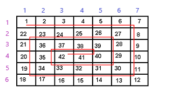
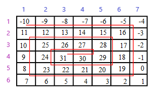

## Snake array

### Create a function that takes a number(it can be any number) and produces a spiral matrix (two-dimensional array) with 7 columns and 6 rows where the start is the number you passed in as an argument. See images below for the pattern. In the first example snakeArray(1) was called. The second one snakeArray(-10).

 

