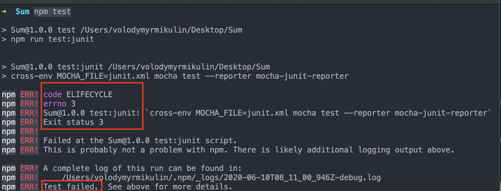
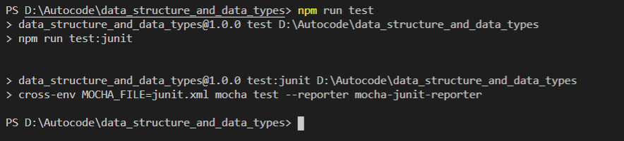
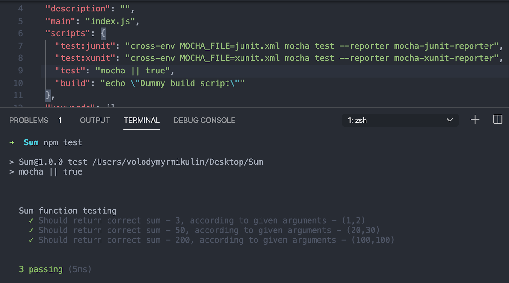

# Preparation for the task solving

1. Choose a development environment and install it (VSCode, Webstorm, Sublime, etc.)

2. Install NodeJS: https://nodejs.org/uk/ (It is advised to use node js of version 12 or lower. If you use any of the features that are not supported by v12, the score won't be submitted.

3. Fork this repository

4. Clone your newly forked repository (use git clone <repository-name> (git should be installed first: https://git-scm.com/downloads)

5. Go to the project folder 

6. Install dependencies (use npm install)

7. Run  npm test in the command line. If you see the following:

<strong> it means that you failed the tests (“errno 3 “ means that you failed 3 tests)</strong>
<br> <strong>And if you see the following (empty result):</strong>
<br><br>
<strong> it means that you have passed the tests. </strong>

8. But if you’d like to see more detailed info on your results you need to change some scripts in package.json <br>
Our scripts now:
```js
"scripts": {
   "test:junit": "cross-env MOCHA_FILE=junit.xml mocha test --reporter mocha-junit-reporter",
   "test:xunit": "cross-env MOCHA_FILE=xunit.xml mocha test --reporter mocha-xunit-reporter",
   "test": "npm run test:junit",
   "build": "echo \"Dummy build script\""
 },
```  
You need to replace “test” script with this:
```js
"test": "mocha || true",
```

Run “npm test” again. The result should look like this:



## !! IMPORTANT !! Before you commit this task for Autocode testing you must return your scripts back to the defaults.
```js
"test": "npm run test:junit"
```
### Otherwise autocode tests will fail.
<hr>
<hr>
<hr>
<br>

# Even numbers in array task

### Array is given. Create a function called “evenNumbersInArray”. It should return an array with only even numbers in it.
1. If the given argument is not an array, return "Passed argument is not an array or empty".
2. If the given argument does not contain even numbers, return "Passed array does not contain even numbers"


### For example:
```js
evenNumbersInArray([1, 2, 3, 4, 5, 6]) // [2,4,6]
evenNumbersInArray([28, 44, 11, 22, 13, 76]) // [28,44,22,76]
evenNumbersInArray([1, 11, 47]) // 'Passed array does not contain even numbers'
evenNumbersInArray([5]) // 'Passed array does not contain even numbers'
evenNumbersInArray([]) //'Passed argument is not an array or empty'
evenNumbersInArray(55) //'Passed argument is not an array or empty'
```
